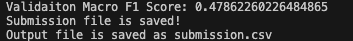

# brAIn_1th_A_Session_Second_Assignment

이 프로젝트는 brAIn 1기 A 세션의 두 번째 과제입니다. 이 README 파일은 프로젝트를 설치하고 실행하는 방법을 안내합니다.

## 목차
1. [설치 방법](#1-설치-방법)
2. [실행 방법](#2-실행-방법)
3. [결과 예시](#3-결과-예시)

## 1. 설치 방법

프로젝트를 설치하려면 다음 단계를 따르세요:

1. VSCODE에서 터미널을 엽니다.

3. 다음 명령어를 사용하여 프로젝트를 복제합니다:
   ```
   git clone https://github.com/rkdrn79/brAIn_1th_A_Session_Second_Assignment.git
   ```

4. 복제된 프로젝트 폴더로 이동합니다:
   ```
   cd brAIn_1th_A_Session_Second_Assignment
   ```

5. 필요한 패키지를 설치합니다:
   ```
   pip install -r requirements.txt
   ```

이제 프로젝트 설치가 완료되었습니다!

## 2. 실행 방법

프로젝트를 실행하려면 다음 단계를 따르세요:

1. 터미널이나 명령 프롬프트에서 프로젝트 폴더 내에 있는지 확인합니다.

2. 다음 명령어를 입력하여 프로그램을 실행합니다:
   ```
   python main.py --submit 제출파일이름
   ```

3. 프로그램이 실행되면 콘솔에 출력되는 내용을 확인하세요.

## 3. 결과 예시

아래는 결과 이미지의 예시입니다:


